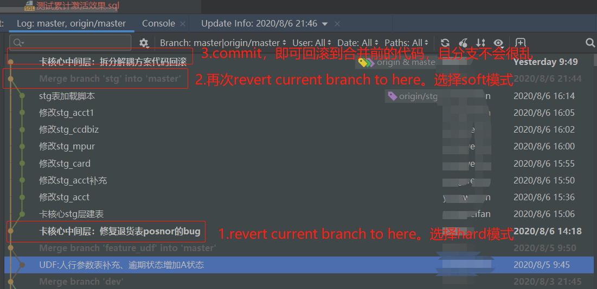

## 实操经验

#### 1.错误合并了另一个分支的代码，并且提交到了远程分支
1.1另一个分支的代码完全不要，基于合并前的代码进行修改。
- 处理方案1（推荐）：
    - 第一次revert当前分支到合并前的位置，hard模式。本地代码为合并前
    - 第二次revert当前分支到合并后的位置，soft模式。本地分支基准代码为合并后，合并前的代码作为变动记录，再次提交之后即可。

效果截图：

- 处理方案2（不推荐）：
    - 直接revert，而不是选择 revert current branch to here
    - 解决完冲突后，强制push到远程方式
> 这种方式很粗暴，且用revert回滚是进行的合并回滚，即假设当前数据里有个文件a.txt,要回滚到的版本里没有a.txt,在log中使用revert回滚的话会造成回滚后的数据中仍然a.txt，不会进行删除！

> 参考文档：[idea操作git回滚远程分支](https://blog.csdn.net/weixin_44647371/article/details/88142371)

1.2基于合并前的代码，对另一个分支的代码进行修改后提交
- revert current branch to 合并前的位置，选择mixed模式
- 代码看起来跟合并后的一样，但是看local change就会看到代码的不同，适当修改后，重新commit

